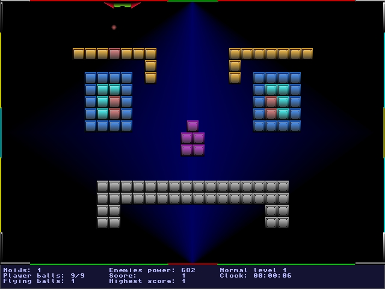

# overview
This is a pointer to a very old project hosted in sourceforge

Website: https://opennoid.sourceforge.net/

# opennoid

Open Noid, or just "Noid", is a Linux game based on the old famous Arkanoid but with a little difference: the players are able to slide on any of the four sides of the screen! It includes a sound engine, network multiplayer, level configuration, a lot of enemy types, and many more....

Only one library was used in this project: svgalib. This library was needed to do the graphic support, but the sound and graphic loading routines and the networking were completely written with ansi-C.

Note that this game was not developed to be a professional game. We just developed to have some fun! :)

